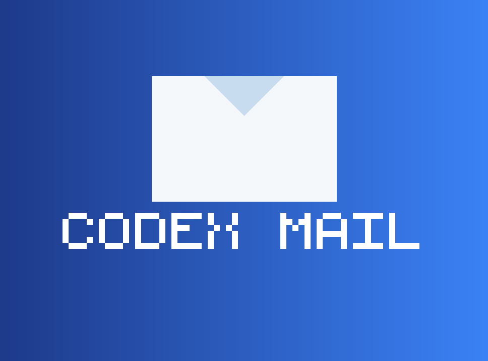

# Codex Mail

&ensp;

<p align="center">
  
</p>

<p align="center">
  <a href="https://buymeacoffee.com/aspradhan">
    
  </a>
  <a href="LICENSE">
    
  </a>
  <a href="https://github.com/ApexHockey/codex_mail/issues">
    
  </a>
</p>

&ensp;

**Codex Mail** is a unified platform that combines a powerful MCP (Model Context Protocol) server with multi-agent coordination capabilities. It provides a "mail-like" coordination layer for AI coding agents, allowing multiple agents (Codex CLI, Claude Code, Gemini CLI, etc.) to work together harmoniously on the same project.

Built on the foundation of OpenAI's Codex with enhanced multi-agent orchestration and a web-based coordination frontend.

> 💡 **Dual Licensing Available**: Use under Apache 2.0 (open source) or [Commercial License](LICENSE-COMMERCIAL.md) with priority support. [Support the project ☕](https://buymeacoffee.com/aspradhan)

&ensp;
## What's New

### 🎉 Agent Coordination Layer (NEW!)

Codex Mail now includes a complete **multi-agent coordination system**:

- **📧 Mail-like messaging** – Agents communicate via inbox/outbox with GitHub-flavored Markdown
- **🔒 File reservations** – Advisory "leases" prevent agents from conflicting on the same files
- **🌐 Web UI** – Human oversight dashboard for browsing projects, agents, and messages
- **🤖 Agent identities** – Memorable names (e.g., `GreenCastle`, `BlueLake`) for each agent instance
- **🔍 Full-text search** – SQLite FTS5-powered search across all agent communications
- **📊 Human Overseer** – Send high-priority messages to agents directly from the web UI

### Code v0.4.0 Features

- **Auto Drive orchestration** – Multi-agent automation that now self-heals and ships complete tasks
- **Unified settings overlay** – `/settings` centralizes limits, model routing, themes, and CLI integrations
- **Card-based activity stream** – Agents, browser sessions, web search, and Auto Drive render as compact cards
- **Turbocharged performance** – History rendering and streaming optimized for long multi-agent sessions
- **Smarter agent routing** – Mix and match orchestrator CLIs (Claude, Gemini, GPT-5, Qwen, and more)

&ensp;
## Why Codex Mail

### Multi-Agent Coordination
- 📧 **Mail system for agents** – Asynchronous messaging with threading and acknowledgments
- 🔒 **File reservation system** – Prevent conflicts with advisory leases on files/globs
- 👥 **Agent identities** – Memorable, persistent identities for each agent instance
- 🔍 **Searchable history** – FTS5 full-text search across all agent communications
- 🌐 **Web dashboard** – Human oversight with project/agent/message browsing
- 🤝 **Cross-project coordination** – Link frontend/backend repos for harmonized development

### Auto Drive & Orchestration
- 🚀 **Auto Drive orchestration** – Multi-agent automation that now self-heals and ships complete tasks
- 🖥️ **GUI Mode** – Optional graphical interface with point-and-click controls
- 🌐 **Browser Integration** – CDP support, headless browsing, screenshots captured inline
- 🤖 **Multi-agent commands** – `/plan`, `/code` and `/solve` coordinate multiple CLI agents
- 🧭 **Unified settings hub** – `/settings` overlay for limits, theming, approvals, and provider wiring
- 🎨 **Theme system** – Switch between accessible presets, customize accents, and preview live via `/themes`
- 🔌 **MCP support** – Extend with filesystem, DBs, APIs, or your own tools
- 🔒 **Safety modes** – Read-only, approvals, and workspace sandboxing

## Quickstart

### Agent Coordination Server (NEW!)

Start the MCP coordination server for multi-agent workflows:

```bash
# Install uv (Python package installer)
curl -LsSf https://astral.sh/uv/install.sh | sh
export PATH="$HOME/.local/bin:$PATH"

# Clone and setup
git clone https://github.com/ApexHockey/codex_mail
cd codex_mail

# Create virtual environment and install dependencies
uv python install 3.14
uv venv -p 3.14
source .venv/bin/activate  # On Windows: .venv\Scripts\activate
uv sync

# Auto-detect and integrate with coding agents
scripts/automatically_detect_all_installed_coding_agents_and_install_mcp_agent_mail_in_all.sh

# Start the MCP server (port 8765)
scripts/run_server_with_token.sh
```

**Access the Web UI:** Open `http://127.0.0.1:8765/mail` in your browser to:
- Browse projects and agents
- View message threads and conversations
- Send messages to agents as "Human Overseer"
- Search across all agent communications
- Monitor file reservations and activity

See [docs/AGENT_ONBOARDING.md](docs/AGENT_ONBOARDING.md) for detailed setup and [docs/CROSS_PROJECT_COORDINATION.md](docs/CROSS_PROJECT_COORDINATION.md) for multi-repo workflows.

### GUI Mode

For a graphical, click-ops experience on **Windows, macOS, or Linux**:

**Windows (PowerShell):**
```powershell
.\launch-gui.ps1
```

**macOS / Linux:**
```bash
./launch-gui.sh
```

This launches Code in a native desktop window with:
- Point-and-click interface
- Toolbar buttons for common commands
- Embedded terminal with full Code functionality
- Cross-platform support (Windows, macOS, Linux)

See [QUICKSTART_GUI.md](QUICKSTART_GUI.md) or [docs/CROSS_PLATFORM_GUI.md](docs/CROSS_PLATFORM_GUI.md) for platform-specific instructions.

### CLI Mode

#### Run

```bash
npx -y @aspradhan/code
```

#### Install & Run

```bash
npm install -g @aspradhan/codex
code // or `coder` if you're using VS Code
```

Note: If another tool already provides a `code` command (e.g. VS Code), our CLI is also installed as `coder`. Use `coder` to avoid conflicts.

**Authenticate** (one of the following):
- **Sign in with ChatGPT** (Plus/Pro/Team; uses models available to your plan)
  - Run `code` and pick "Sign in with ChatGPT"
- **API key** (usage-based)
  - Set `export OPENAI_API_KEY=xyz` and run `code`

### Install Claude & Gemini (optional)

Code supports orchestrating other AI CLI tools. Install these and config to use alongside Code.

```bash
# Ensure Node.js 20+ is available locally (installs into ~/.n)
npm install -g n
export N_PREFIX="$HOME/.n"
export PATH="$N_PREFIX/bin:$PATH"
n 20.18.1

# Install the companion CLIs
export npm_config_prefix="${npm_config_prefix:-$HOME/.npm-global}"
mkdir -p "$npm_config_prefix/bin"
export PATH="$npm_config_prefix/bin:$PATH"
npm install -g @anthropic-ai/claude-code @google/gemini-cli @qwen-code/qwen-code

# Quick smoke tests
claude --version
gemini --version
qwen --version
```

> ℹ️ Add `export N_PREFIX="$HOME/.n"` and `export PATH="$N_PREFIX/bin:$PATH"` (plus the `npm_config_prefix` bin path) to your shell profile so the CLIs stay on `PATH` in future sessions.

&ensp;
## Commands

### Browser
```bash
# Connect code to external Chrome browser (running CDP)
/chrome        # Connect with auto-detect port
/chrome 9222   # Connect to specific port

# Switch to internal browser mode
/browser       # Use internal headless browser
/browser https://example.com  # Open URL in internal browser
```

### Agents
```bash
# Plan code changes (Claude, Gemini and GPT-5 consensus)
# All agents review task and create a consolidated plan
/plan "Stop the AI from ordering pizza at 3AM"

# Solve complex problems (Claude, Gemini and GPT-5 race)
# Fastest preferred (see https://arxiv.org/abs/2505.17813)
/solve "Why does deleting one user drop the whole database?"

# Write code! (Claude, Gemini and GPT-5 consensus)
# Creates multiple worktrees then implements the optimal solution
/code "Show dark mode when I feel cranky"
```

### Auto Drive
```bash
# Hand off a multi-step task; Auto Drive will coordinate agents and approvals
/auto "Refactor the auth flow and add device login"

# Resume or inspect an active Auto Drive run
/auto status
```

### General
```bash
# Try a new theme!
/themes

# Change reasoning level
/reasoning low|medium|high

# Switch models or effort presets
/model

# Start new conversation
/new
```

&ensp;
## Multi-Agent Coordination

### Real-World Use Cases

**1. Frontend + Backend Development**
```
Backend Agent (GreenCastle) ←→ Frontend Agent (BlueLake)
         ↓                              ↓
    Express.js API              React Components
         ↓                              ↓
    Shared thread: "User Authentication Flow"
```

Both agents coordinate on API contracts, share design decisions, and avoid stepping on each other's work through file reservations.

**2. Feature Development with Multiple Agents**
```python
# Agent A reserves auth routes
reserve_file_paths(
    project_key="/path/to/backend",
    agent_name="GreenCastle",
    paths=["src/auth/**/*.py"],
    exclusive=True,
    ttl_seconds=3600
)

# Agent B works on different area
reserve_file_paths(
    project_key="/path/to/backend", 
    agent_name="BlueLake",
    paths=["src/api/users/**/*.py"],
    exclusive=True,
    ttl_seconds=3600
)
```

**3. Cross-Repository Coordination**
```bash
# Frontend agent checks messages from backend team
fetch_inbox(
    project_key="/path/to/frontend",
    agent_name="BlueLake",
    urgent_only=True
)

# Send update about API changes
send_message(
    project_key="/path/to/backend",
    sender_name="GreenCastle",
    to=["BlueLake"],
    subject="API: New authentication endpoints",
    thread_id="FEAT-auth-123"
)
```

### MCP Server Tools

The coordination server provides these key tools:

- **`register_agent`** - Create a persistent agent identity
- **`send_message`** - Send GitHub-flavored Markdown messages
- **`fetch_inbox`** - Check for new messages and updates
- **`reserve_file_paths`** - Claim files/globs to prevent conflicts
- **`release_file_reservations`** - Release file claims when done
- **`search_messages`** - Full-text search across all communications
- **`summarize_thread`** - Get AI summaries of conversation threads

Full tool documentation: [README_CODEX_MAIL.md](README_CODEX_MAIL.md)

&ensp;
## 📚 Documentation

**Complete Documentation Index**: [DOCUMENTATION.md](DOCUMENTATION.md)

Quick links:
- **[Getting Started](docs/getting-started.md)** - Detailed setup guide
- **[Integration Guide](INTEGRATION_GUIDE.md)** - Complete integration walkthrough
- **[Agent Onboarding](docs/AGENT_ONBOARDING.md)** - Agent setup cookbook
- **[Configuration Reference](docs/config.md)** - All configuration options
- **[Slash Commands](docs/slash-commands.md)** - Command reference
- **[FAQ](docs/faq.md)** - Frequently asked questions

&ensp;
## CLI reference

```shell
code [options] [prompt]

Options:
  --model <name>        Override the model (gpt-5, claude-opus, etc.)
  --read-only          Prevent file modifications
  --no-approval        Skip approval prompts (use with caution)
  --config <key=val>   Override config values
  --oss                Use local open source models
  --sandbox <mode>     Set sandbox level (read-only, workspace-write, etc.)
  --help              Show help information
  --debug             Log API requests and responses to file
  --version           Show version number
```

&ensp;
## Memory & project docs

Code can remember context across sessions:

1. **Create an `AGENTS.md` or `CLAUDE.md` file** in your project root:
```markdown
# Project Context
This is a React TypeScript application with:
- Authentication via JWT
- PostgreSQL database
- Express.js backend

## Key files:
- `/src/auth/` - Authentication logic
- `/src/api/` - API client code  
- `/server/` - Backend services
```

2. **Session memory**: Code maintains conversation history
3. **Codebase analysis**: Automatically understands project structure

&ensp;
## Non-interactive / CI mode

For automation and CI/CD:

```shell
# Run a specific task
code --no-approval "run tests and fix any failures"

# Generate reports
code --read-only "analyze code quality and generate report"

# Batch processing
code --config output_format=json "list all TODO comments"
```

&ensp;
## Model Context Protocol (MCP)

Code supports MCP for extended capabilities:

- **File operations**: Advanced file system access
- **Database connections**: Query and modify databases
- **API integrations**: Connect to external services
- **Custom tools**: Build your own extensions
- **Agent coordination**: Use the Codex Mail MCP server for multi-agent workflows

### Codex Mail MCP Server

Configure your agents to use the coordination server:

**For Codex CLI** (`~/.code/config.toml`):
```toml
[mcp_servers.codex_mail]
command = "npx"
args = ["-y", "@modelcontextprotocol/server-http", "http://127.0.0.1:8765/mcp/"]
```

**For Claude Code** (`.claude/settings.json`):
```json
{
  "mcpServers": {
    "codex-mail": {
      "type": "http",
      "url": "http://127.0.0.1:8765/mcp/",
      "headers": { "Authorization": "Bearer ${CODEX_MAIL_TOKEN}" }
    }
  }
}
```

**For Gemini CLI** (`gemini.mcp.json`):
```json
{
  "mcpServers": {
    "codex-mail": {
      "type": "http",
      "url": "http://127.0.0.1:8765/mcp/"
    }
  }
}
```

### Other MCP Servers

Configure MCP in `~/.code/config.toml` Define each server under a named table like `[mcp_servers.<name>]`:

```toml
[mcp_servers.filesystem]
command = "npx"
args = ["-y", "@modelcontextprotocol/server-filesystem", "/path/to/project"]
```

&ensp;
## Configuration

Main config file: `~/.code/config.toml`

> [!NOTE]
> Code reads from both `~/.code/` and `~/.codex/` for backwards compatibility, but it only writes updates to `~/.code/`. If you switch back to Codex and it fails to start, remove `~/.codex/config.toml`. If Code appears to miss settings after upgrading, copy your legacy `~/.codex/config.toml` into `~/.code/`.

```toml
# Model settings
model = "gpt-5"
model_provider = "openai"

# Behavior
approval_policy = "on-request"  # untrusted | on-failure | on-request | never
model_reasoning_effort = "medium" # low | medium | high
sandbox_mode = "workspace-write"

# UI preferences see THEME_CONFIG.md
[tui.theme]
name = "light-photon"

# Add config for specific models
[profiles.gpt-5]
model = "gpt-5"
model_provider = "openai"
approval_policy = "never"
model_reasoning_effort = "high"
model_reasoning_summary = "detailed"
```

### Environment variables

**Code CLI:**
- `CODE_HOME`: Override config directory location
- `OPENAI_API_KEY`: Use API key instead of ChatGPT auth
- `OPENAI_BASE_URL`: Use alternative API endpoints
- `OPENAI_WIRE_API`: Force the built-in OpenAI provider to use `chat` or `responses` wiring

**MCP Coordination Server:**
- `STORAGE_ROOT`: Root directory for Git repos and SQLite DB (default: `~/.mcp_agent_mail_git_mailbox_repo`)
- `HTTP_HOST`: Bind host (default: `127.0.0.1`)
- `HTTP_PORT`: Bind port (default: `8765`)
- `HTTP_BEARER_TOKEN`: Optional static bearer token for authentication
- `LLM_ENABLED`: Enable AI features for summaries and discovery (default: `true`)
- `LLM_DEFAULT_MODEL`: Default LLM model for summaries (default: `gpt-5-mini`)

See `.env.example` for complete MCP server configuration options.

&ensp;
## FAQ

**What is Codex Mail?**
> Codex Mail is an integrated platform combining OpenAI's Codex CLI with a powerful multi-agent coordination system. It provides mail-like messaging, file reservations, and a web UI for orchestrating multiple AI coding agents working on the same project.

**How is this different from the original Codex?**
> This adds browser integration, multi-agent commands (`/plan`, `/solve`, `/code`), theme system, enhanced reasoning controls, AND a complete MCP coordination server with web UI for managing multiple agents across projects.

**When should I use the coordination server?**
> Use it when you have:
> - Multiple agents working on the same codebase
> - Frontend and backend teams (separate repos) that need to coordinate
> - Agents that might conflict on file changes
> - Need for searchable agent communication history
> - Want human oversight of agent activities

**Can I use my existing Codex configuration?**
> Yes. Code reads from both `~/.code/` (primary) and legacy `~/.codex/` directories. We only write to `~/.code/`, so Codex will keep running if you switch back; copy or remove legacy files if you notice conflicts.

**Does this work with ChatGPT Plus?**
> Absolutely. Use the same "Sign in with ChatGPT" flow as the original.

**Does the coordination server work with other agents besides Codex?**
> Yes! It works with Claude Code, Gemini CLI, Cursor, and any MCP-compatible coding agent. The integration scripts automatically detect and configure installed agents.

**Is my data secure?**
> Yes. Authentication stays on your machine, and we don't proxy your credentials or conversations. The MCP server stores all data locally in Git repositories and SQLite databases on your machine.


&ensp;
## Architecture

### System Overview

```
┌─────────────────────────────────────────┐
│   Coding Agents (Codex, Claude, etc.)   │
│   - Each with unique identity           │
│   - Independent working directories     │
└────────────────┬────────────────────────┘
                 │ HTTP (MCP Tools/Resources)
┌────────────────▼────────────────────────┐
│     Codex Mail MCP Server (FastMCP)     │
│  ┌────────────────┐  ┌────────────────┐ │
│  │  Web UI        │  │  MCP Endpoint  │ │
│  │  /mail/*       │  │  /mcp/         │ │
│  │  Human         │  │  Agent         │ │
│  │  Oversight     │  │  Coordination  │ │
│  └────────────────┘  └────────────────┘ │
└────────┬────────────────────┬───────────┘
         │                    │
         ▼                    ▼
┌────────────────┐  ┌────────────────────┐
│   Git Storage  │  │   SQLite + FTS5    │
│  (Markdown)    │  │  (Metadata/Search) │
│  - Messages    │  │  - Agent registry  │
│  - Profiles    │  │  - Full-text index │
│  - File leases │  │  - Relationships   │
└────────────────┘  └────────────────────┘
```

### Data Flow

1. **Agent Registration**: Agents get memorable names (e.g., `GreenCastle`) and persistent profiles
2. **Messaging**: Agents send/receive GitHub-flavored Markdown messages with threading
3. **File Reservations**: Agents claim files/globs to signal editing intent
4. **Search & Summarize**: Full-text search and AI summaries across all communications
5. **Human Oversight**: Web UI for browsing, searching, and sending priority messages


&ensp;
## 💰 Support This Project

**☕ [Buy Me A Coffee](https://buymeacoffee.com/aspradhan)**

Your support helps maintain and improve Codex Mail! Every contribution goes directly toward:
- 🔧 Maintaining the codebase
- ✨ Developing new features  
- 🐛 Bug fixes and improvements
- 📚 Documentation and tutorials
- 🤝 Community support

### Dual Licensing Options

Codex Mail is available under two licenses:

1. **[Apache 2.0](LICENSE)** (Open Source)
   - ✅ Free to use, modify, and distribute
   - ✅ Perfect for open-source projects
   - ✅ Community-driven development

2. **[Commercial License](LICENSE-COMMERCIAL.md)** (from AU$25/month)
   - ✅ Priority support with SLAs
   - ✅ Custom features and integrations
   - ✅ Legal indemnification
   - ✅ Private modifications allowed
   - ✅ Perfect for commercial products

**[Learn more about Commercial Licensing →](LICENSE-COMMERCIAL.md)**


&ensp;
## Contributing

We welcome contributions to both the Codex CLI and the coordination server!

### Development workflow

**For Codex CLI:**
```bash
# Clone and setup
git clone https://github.com/ApexHockey/codex_mail.git
cd codex_mail
npm install

# Build (use fast build for development)
./build-fast.sh

# Run locally
./code-rs/target/dev-fast/code
```

**For MCP Server:**
```bash
# Setup Python environment
uv venv -p 3.14
source .venv/bin/activate
uv sync --dev

# Run tests
uv run pytest

# Start development server
uv run python -m mcp_agent_mail.cli serve-http
```

### Opening a pull request

1. Fork the repository
2. Create a feature branch: `git checkout -b feature/amazing-feature`
3. Make your changes
4. Run tests (Rust: `cargo test`, Python: `pytest`)
5. Build successfully: `./build-fast.sh`
6. Submit a pull request


&ensp;
## Legal & Use

### Dual Licensing Model

**Codex Mail** is available under a dual-licensing model:

1. **[Apache 2.0 License](LICENSE)** - Open source, free to use
   - Use, modify, and distribute freely
   - Must retain license and attribution notices
   - No warranties or support guarantees
   - Perfect for open-source projects

2. **[Commercial License](LICENSE-COMMERCIAL.md)** - Commercial use with benefits
   - Priority support with SLAs
   - Custom features and integrations  
   - Legal indemnification and warranties
   - Private modifications allowed
   - Starting at AU$25/month per user
   - [Learn more →](LICENSE-COMMERCIAL.md)

Choose the license that best fits your needs. You can start with Apache 2.0 and upgrade to commercial licensing anytime.

### License & attribution
- The Codex CLI component is based on `openai/codex` under **Apache-2.0**. We preserve upstream LICENSE and NOTICE files.
- The MCP coordination server is based on `mcp_agent_mail` by [Dicklesworthstone](https://github.com/Dicklesworthstone/mcp_agent_mail) under **MIT**.
- **Codex Mail** is **not** affiliated with, sponsored by, or endorsed by OpenAI or Anthropic.

### Your responsibilities
Using OpenAI, Anthropic or Google services through Code means you agree to **their Terms and policies**. In particular:
- **Don't** programmatically scrape/extract content outside intended flows.
- **Don't** bypass or interfere with rate limits, quotas, or safety mitigations.
- Use your **own** account; don't share or rotate accounts to evade limits.
- If you configure other model providers, you're responsible for their terms.

### Privacy
- Your auth file lives at `~/.code/auth.json`
- Inputs/outputs you send to AI providers are handled under their Terms and Privacy Policy; consult those documents (and any org-level data-sharing settings).

### Subject to change
AI providers can change eligibility, limits, models, or authentication flows. Code supports **both** ChatGPT sign-in and API-key modes so you can pick what fits (local/hobby vs CI/automation).

&ensp;
## License

**Dual Licensed** - Choose the option that works best for you:

- **[Apache 2.0](LICENSE)** - Open source license (free)
- **[Commercial License](LICENSE-COMMERCIAL.md)** - Commercial use with priority support (from AU$25/month)

See [LICENSE](LICENSE) file for Apache 2.0 terms, or [LICENSE-COMMERCIAL.md](LICENSE-COMMERCIAL.md) for commercial licensing options.

This project is a community-enhanced version of the original Codex CLI. We maintain compatibility while adding features requested by the developer community.

**Support the project:** ☕ [Buy Me a Coffee](https://buymeacoffee.com/aspradhan)

&ensp;
---
**Need help?** Open an issue on [GitHub](https://github.com/ApexHockey/codex_mail/issues) or check our [complete documentation](DOCUMENTATION.md).
